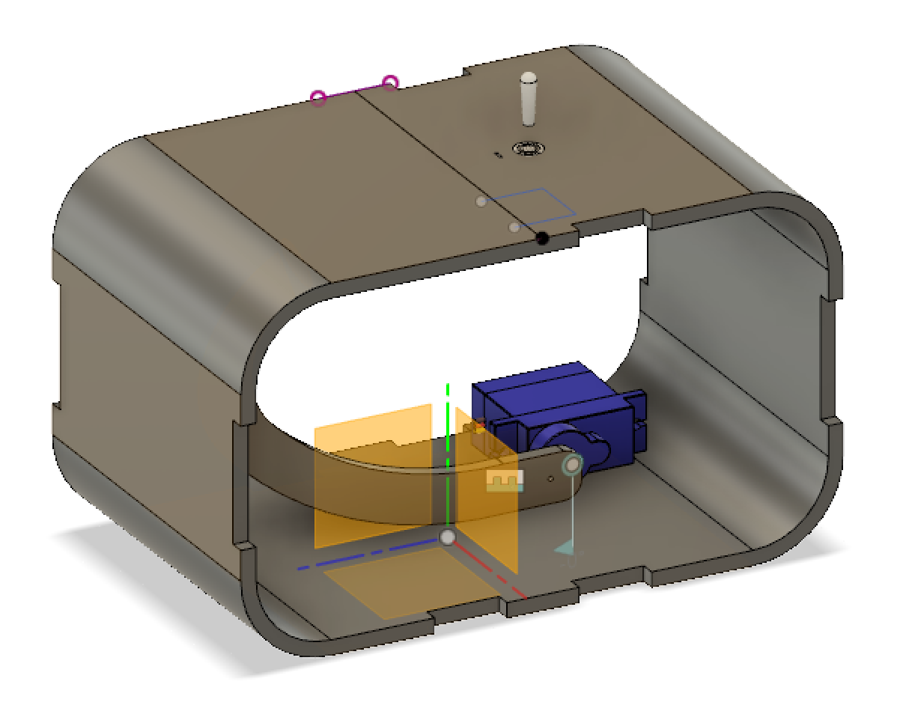
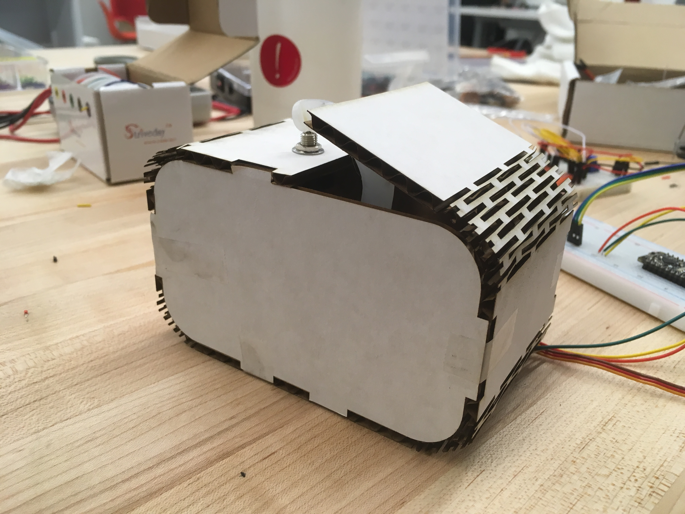
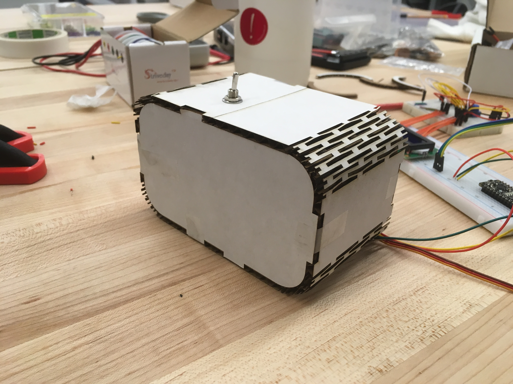

# Useless Box

## 3D Printing

**a. Include a photo of your printed part here.**

**b. Include `.stl` or `.svg` files for your bopper, if 3d-printing.**

[bopper](dopper.dxf)

[tapper](tapper.dxf)

## Laser Cutting

**b. Include a photo of your box here.**

## Electronics

**c. Upload code & a photo of your electronic circuit here.**

## Putting it All Together

Include here:
1. Your Arduino code.
1. `.stl` or `.svg` files for your "bopper" — if you use some other technique, include the respective supporting material.
1. At least one photo of your useless box taken in the MakerLab's Portable Photo Studio (or somewhere else, but of similar quality).
1. A video of your useless box in action.
