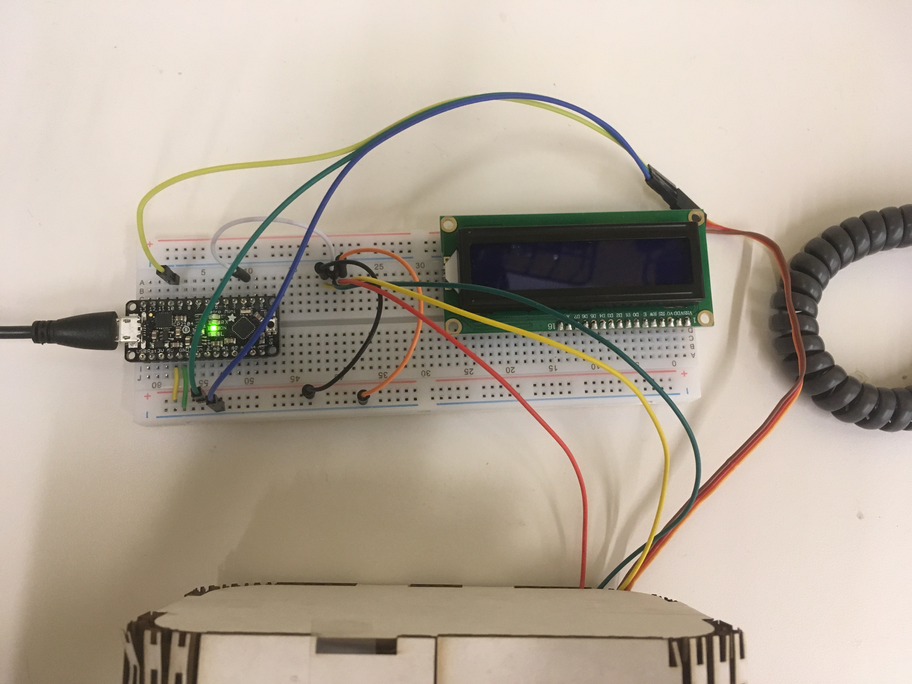
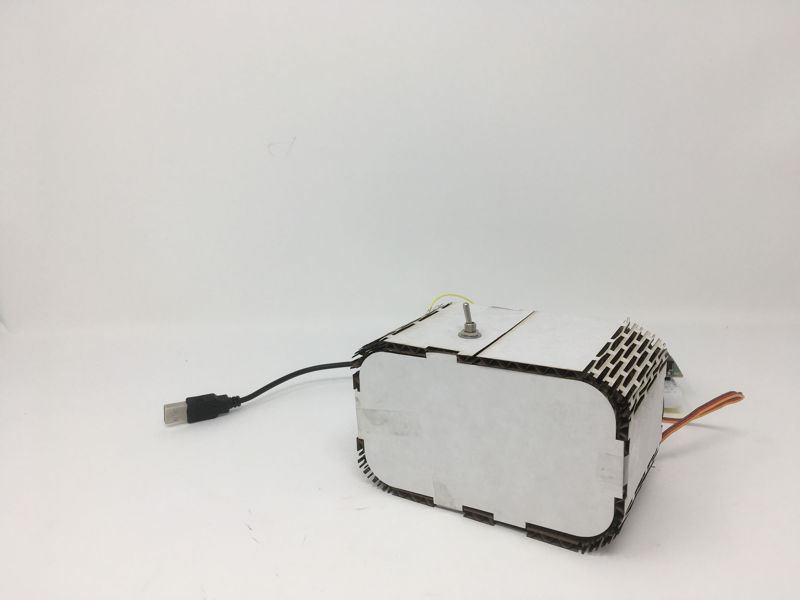

# Useless Box

## 3D Printing

**a. Include a photo of your printed part here.**


**b. Include `.stl` or `.svg` files for your bopper, if 3d-printing.**

[bopper](dopper.dxf)

[tapper](tapper.dxf)

## Laser Cutting

**b. Include a photo of your box here.**


## Electronics

**c. Upload code & a photo of your electronic circuit here.**



## Putting it All Together

Include here:
1. Your Arduino code.
```C++
#include <Servo.h> 

#define servoPin  10
#define switchPin 2

#define closePos  0
#define openPos   70

Servo servo;
int switchState;
int previousSwitchState;

// call this when the input on pin 2 changes (LOW to HIGH *or* HIGH to LOW)
void ToggleSwitch(int switchState)
{    
  if (switchState == HIGH)
  {
    servo.write(openPos);
    //Serial.println("switch state is HIGH.  servo.write(openPos) called to open useless box");
  }
  else
  {
    servo.write(closePos);
    //Serial.println("switch state is LOW.   servo.write(closePos) called to close useless box");
  }
  previousSwitchState = switchState;  // remember that the switch state has changed 
}

void setup()
{
  //Serial.begin(9600);
  //Serial.println("Useless Box Lab 5");

  // start with the box closed and the switch in the off postion
  switchState = LOW;
  previousSwitchState = LOW;

  // connect to our servo and make sure it is in the closed position
  servo.attach(servoPin);
  servo.write(closePos);

  // we should probably pay attention to the switch
  pinMode(switchPin, INPUT); 
}

void loop()
{ 
  int switchState = digitalRead(switchPin);
  if (switchState != previousSwitchState)
    ToggleSwitch(switchState);

  delay(20);
}
```
1. `.stl` or `.svg` files for your "bopper" — if you use some other technique, include the respective supporting material.

[Link to bobber.dxf](bobber.dxf)

1. At least one photo of your useless box taken in the MakerLab's Portable Photo Studio (or somewhere else, but of similar quality).



1. A video of your useless box in action.
[Video] https://drive.google.com/open?id=1GU5cSxsx_JOCTYJi_lDGaFXbV5j2i23Z

My box was unable to flip the switch.  I think the problem was that my bobber was too long to utilize all of the force of the servo motor.  I should have designed my box so the servo could be mounted on the top so the bobber could be shorter.
